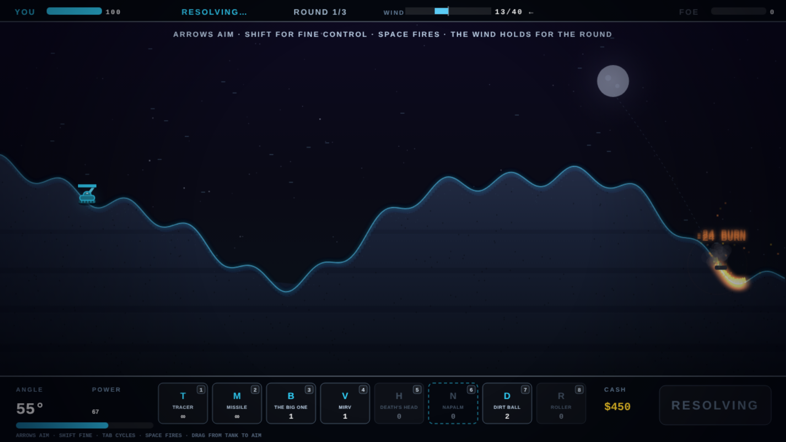

# NEON SCORCH

Seventh game in the harsh-critic-loop series, after
[NEONOID](https://github.com/melvincarvalho/neonoid),
[NEON MINER](https://github.com/melvincarvalho/neonminer),
[NEODROID](https://github.com/melvincarvalho/neodroid),
[NEON DASH](https://github.com/melvincarvalho/neondash),
[NEONLINGS](https://github.com/melvincarvalho/neonlings) and
[NEOPOLIS](https://github.com/melvincarvalho/neopolis). A Scorched Earth
tribute: turn-based artillery on a destructible neon ridge. Angle, power,
and a wind that holds for the round; craters that remember; tanks that
fall when you dig the hill out from under them; an arsenal economy paid
in damage. Original tanks and worlds — the real Scorched Earth (Wendell
Hicken, 1991) is shareware royalty, and revered here.

**Play it: <https://melvincarvalho.github.io/neonscorch/>**



**There are no assets.** Every pixel and every sound is generated from
code. Two files: `index.html`, `game.js`. Arrows aim (Shift for fine
control), Space fires, Tab cycles weapons — or drag from your tank to aim
by vector, with a predicted-arc guide. Damage earns cash; spend it in the
armory between rounds. Best of three rounds.

```bash
python3 -m http.server 8000   # or just open index.html
```

## The experiment

Same pipeline as the first six games — one owner builds, deterministic
`?shot=` captures, four harsh sub-agent critics (three visual lenses plus
a Scorched-Earth-fidelity judge), consensus fixes, re-score to plateau —
with the harness turned adversarial on destructible ground: **duels as
theorems.**

`tools/playtest.sh` proves 17 claims headlessly, every build:

- **the physics against closed form**: the no-wind impact matches the
  analytic parabola to 0.07%; head/calm/tail wind impacts land in strict
  order (580 < 863 < 1147);
- **the duels**: the exact solver must WIN its 3-round match against the
  canon AI (a noisy solver); a futile gunner must LOSE; a solver blinded
  to the wind must LOSE — wind compensation is machine-provenly
  load-bearing;
- **marksmanship measured at the impact, not in the plan**: mean realized
  miss — solver 9px, canon AI 48px, wind-blind 520px, null 1112px;
- **every weapon mechanism in isolation**: crater bite and width, dirt
  pile, undermine-and-fall damage, MIRV's 5-warhead apex split, napalm's
  downhill flow, the roller finding its valley, the shop granting a
  shield that then eats 30 damage — plus full-flight napalm and dirt
  accuracy proofs, and a determinism regression (same seed, identical
  battle log, twice).

## Scores

| round | composition | game-feel | HUD | visual mean | Scorched fidelity |
|---|---|---|---|---|---|
| 1 | 3.4 | 3.6 | 5.5 | **4.2** | 5.5 |
| 2 (final) | 5.0 | 6.4 | 7.0 | **6.1** | 7.0 |

Final-round verdicts: game-feel — *"the land finally remembers every burn
and deaths detonate in stages."* HUD — *"a neon artillery duel whose HUD
finally says whose turn it is."* Fidelity — *"round 2 makes the physics,
the wind, and the shop stop lying — real proofs fly real shells at 8px."*
Composition — *"genuinely lovely napalm over a battlefield that still
whispers."* A post-panel fix batch (the Death's Head made real — 9
warheads carrying its own stats, with the new `mech-deathshead` proof the
fidelity critic noted was "carefully absent"; the wind hint made honest;
tooltips for the new weapons; the AI now fires the rollers it buys; lost
shots counted against marksmanship; resolve-phase and game-over HUD
truthfulness; gravity-curve falls with landing dust; filled fireball
cores; per-round shop pay) was applied after the final scores; the
numbers above are the panel's, not post-fix.

## Honest assessment

- **Two tanks, one AI temperament.** Canon shipped ten tanks and a
  personality ladder from Moron to Unknown; this is a 1v1 against one
  noisy solver. The engine supports four tanks; the game doesn't use
  them yet.
- **Eight weapons vs canon's dozens** — no Funky Bomb, no Leapfrog, no
  Sandhogs, no Death's-Head-tier economy of absurdity beyond the one
  Death's Head.
- **No simultaneous-fire mode, no walls/wraparound options, no taunts** —
  the options screen that gave canon its longevity is absent.
- Staged evidence shots are separate deterministic runs, not one
  continuous playthrough.

## Process notes

1. **The round-2 fidelity critic caught a fraudulent weapon**: the
   Death's Head's own radius and damage were dead config — every split
   warhead silently used the MIRV's stats, making the $1800 flagship a
   repainted $900 MIRV. The proof that would have caught it didn't
   exist; it does now (9 warheads, more impacts, more damage, machine-
   checked against the MIRV in the same run).
2. **The round-1 fidelity critic caught a real ballistics bug the proofs
   had missed**: the live shell applied half wind to napalm and dirt,
   but the AI's ghost integrator applied full wind — so every AI napalm
   and dirt shot systematically missed, and two "evidence" screenshots
   showed the mechanics failing to occur. The isolated mechanism proofs
   had bypassed flight entirely, which is why they stayed green. The fix
   came with the tests that would have caught it: full-flight accuracy
   proofs for both weapons.
3. **The wind was gaslighting its own tracer.** Wind rerolled every
   turn, so the free spotting round taught you about air that no longer
   existed by your next shot. Canon's default — wind steady within a
   round — fixed the mechanic and the tooltip's honesty at once.
4. **The null gunner was accidentally a weapon.** A vertical mortar at
   power 95 drifts with the wind clear across the map; the "futile"
   control was landing hits. Futility had to be engineered down to a
   low-power lob that returns to sender.

## License

Copyright © 2026 Melvin Carvalho.

Licensed under the [GNU Affero General Public License v3.0 or later](LICENSE)
(AGPL-3.0-or-later).
